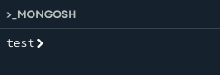
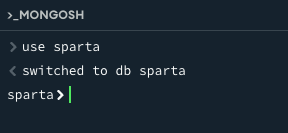
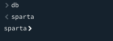
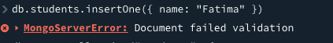
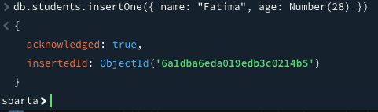

# Intro to MongoDB

MongoDB is a document database that stores JSON-like documents, which allows you to store data with flexible schema and provides querying and aggregation tools for access and analysis.

## MongoDB Use Cases and Advantages / Disadvantages 

Use Cases:
- Social Media posts/data 
- CMS systems 
- CRM systems 
    - Heavy text aspects 
- IoT and Sensor data 
- Logs and monitoring dta 
- Gaming data 
- Chat 

Avdantages:
- Document Oriented Storage 
- Easy Scaling (Horizontal)
- Fast / Efficient 
- "Open Source"
     - Publically available 
     - Source code can be edited / chnaged at will 
     - Free to use, at scale --> no license fees etc, 
     - Code can be distrubted at will 
     - Flexible 


Disadvantages:
- High memory usage and dtaa redundancy 
- Can be inconsistent 
- Unsupported transactions 


## Creatin a new database 

When you open mongosh by default mongosh will open with `test`




To create or switch to a database, use the `use` command, followed by the name of the database you want to use. For example, in this case we will use a database called `sparta`

once we run this command, the `test>` database indiactor should chnage to `sparta>`. 





To see which database you are currently using, use the `db` command.




# Creating a new collection 

A collection is a group of related documents stored together in a MongoDB database(similar to a table in a relational database).

To create a new collection, we use the `db.db.createCollection()` command followed by the name you want to give it in parentheses and quotes. For example, we will create a collection called `institute`.

```
db.db.createCollection("institute")
```

### Inserting data to collection:
To insert data into our collection, we use the `insertOne` command to add a single document.

```
db.institute.insertOne({name: "New document"})
```

### Adding multiple documents in one command:
To add multiple documents in one commnad at the same time, use the `insertMany` command. You must wrap the documents inside square brackets, separated by commas.

```
db.institute.insertMany([{ "course": "Data Engineering" }, { "course": "Data Analysis" }])
```

After inserting your data, you can check if your data is safely inside your database using the following command:

```
db.institute.find()
```

# Validation 
validation is used to create rules for your fields, such as allowed data types and value ranges in order to ensure that all documents in a collection share a similar structure

## Implementing Validation on a New Collection
This command creates a new collection called `students` and tells MongoDB that every document must have a name which must be a string (text) and an age which must be a integer (whole number). 
```
db.createCollection("students", {
   validator: {
      $jsonSchema: {
         bsonType: "object",
         required: [ "name", "age" ],
         properties: {
            name: {
               bsonType: "string",
               description: "must be a string and is required"
            },
            age: {
               bsonType: "int",
               description: "must be an integer and is required"
            }
         }
      }
   }
})
```

Testing if validation rules are working but inputting a valid and invalid entry.

Invalid entry:

This error shows that MongoDB successfully rejected the data because it did not comply with our validation rules


Valid entry:

To successfully insert a document, both the name as a string and the age as a numerical value must be used 


